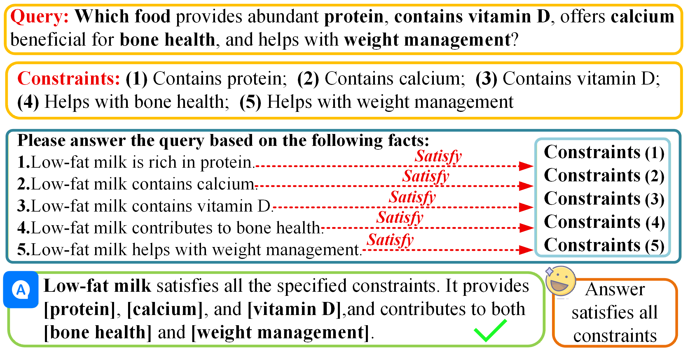
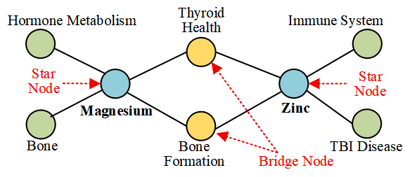
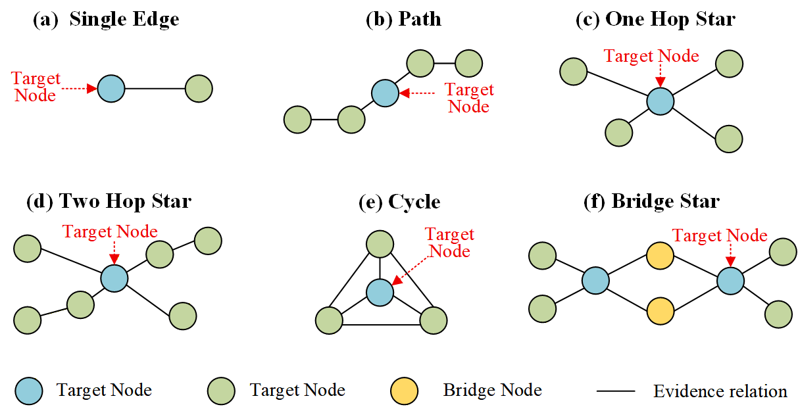
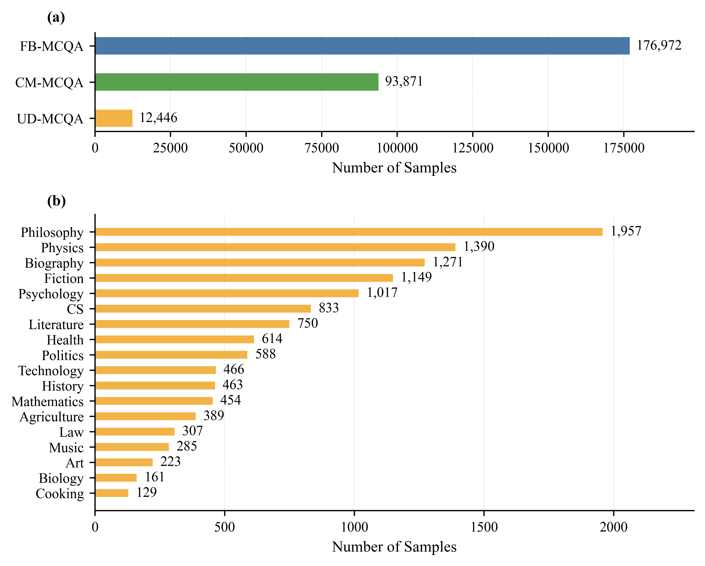

# MCQA-Dataset

MCQA is a structure-grounded benchmark for evaluating retrieval-augmented generation (RAG) under **multi-constraint question answering**.

Current QA and RAG benchmarks often evaluate whether a system can retrieve generally relevant evidence or produce a correct final answer. In many real scenarios, however, a question is only answerable when **all explicit constraints are satisfied at the same time**. A system that satisfies only part of the constraints may still produce a plausible but wrong answer. MCQA is built to expose this failure mode by pairing every query with compact, verifiable evidence graphs and standard answers.

<p align="center">
  
</p>


## Why MCQA?

MCQA is designed around three goals:

1. **Constraint-level evaluation.** Each query contains multiple explicit semantic constraints, and the answer is valid only if all constraints are satisfied.
2. **Structure-grounded construction.** Queries are generated from knowledge-graph substructures, so every constraint can be traced back to structured evidence.
3. **Verifiable evidence.** Each sample is paired with GraphML evidence, and when available, textual evidence, enabling retrieval, answer generation, and explanation consistency checks.

The main construction pattern is **Bridge Star**, which creates ambiguity among same-type candidate entities through shared bridge nodes and then resolves the answer with target-specific constraints.

<p align="center">
  
</p>

MCQA also includes five additional graph structures to test different forms of relational and compositional reasoning.

<p align="center">
  
</p>

## Dataset Overview

The complete release contains **283,289 QA pairs**, **138,165 GraphML evidence files**, and **134,294 text evidence files** across medical, Freebase-style, and open-domain sources.

<p align="center">
  
</p>


| Dataset | Bridge-Star QA | Multi-Structure QA | Total QA | Total GraphML | Total TXT |
|---|---:|---:|---:|---:|---:|
| CM | 90,000 | 3,871 | 93,871 | 33,871 | 30,000 |
| FB | 172,000 | 4,972 | 176,972 | 90,972 | 90,972 |
| UD | 8,304 | 4,142 | 12,446 | 13,322 | 13,322 |
| **Total** | **270,304** | **12,985** | **283,289** | **138,165** | **134,294** |

## Structural Subsets

MCQA contains the original `bridge_star` structure plus five additional graph structures.

| Structure | QA Pairs | Target Node | Main Ability |
|---|---:|---|---|
| `bridge_star` | 270,304 | Core node | Ambiguity-aware multi-constraint reasoning |
| `single_edge` | 2,972 | Endpoint | Atomic factual retrieval |
| `path_4` | 3,000 | Internal/path node | Ordered relational dependency |
| `star_1hop` | 3,000 | Center node | Parallel constraint matching |
| `star_2hop` | 2,094 | Center node | Hierarchical constraint matching |
| `cycle` | 1,919 | Missing cycle node | Closure consistency |

## Repository Layout

This repository is the lightweight GitHub entry point for MCQA. It contains documentation, statistics, generation scripts, and small query samples. The full dataset is distributed as compressed archives through GitHub Releases.

```text
README.md
dataset_card.md
downloads.md
docs/
  schema.md
  assets/
statistics/
  overall_statistics.csv
  structure_statistics.csv
samples/
  CM/
  FB/
  UD/
scripts/
  generation/
```

The full data archives expand into:

```text
MCQA-Dataset/data/
  CM/
  FB/
  UD/
```

Each subset follows:

```text
queries/queries.csv
evidence/
metadata.json
```

## Download

Download the full dataset from the GitHub Release assets:

| Dataset | Archive | Size |
|---|---|---:|
| CM | `mcqa-cm.zip` | 66.97 MB |
| FB | `mcqa-fb.zip` | 162.87 MB |
| UD | `mcqa-ud.zip` | 95.54 MB |

After downloading, unzip the archives into the repository root or another data directory. Each archive contains paths under `MCQA-Dataset/data/<DATASET>/`.

```powershell
Expand-Archive mcqa-cm.zip -DestinationPath .
Expand-Archive mcqa-fb.zip -DestinationPath .
Expand-Archive mcqa-ud.zip -DestinationPath .
```

## How to Use

Each normalized `queries.csv` row links a natural-language query to its gold answer and evidence files.

```csv
id,dataset,domain,structure,query,answer,evidence_graphml,evidence_text,source_file
```

Typical usage:

1. Load `queries/queries.csv`.
2. Read the query and candidate answer from `query` and `answer`.
3. Use `evidence_graphml` to load the structured evidence graph for constraint-level retrieval or verification.
4. Use `evidence_text` when a textual evidence paragraph is available.
5. Evaluate whether a model answer satisfies all query constraints, not only whether it is semantically close to the gold answer.

Minimal Python example:

```python
import csv
from pathlib import Path

root = Path("MCQA-Dataset/data/CM")
query_file = root / "queries" / "queries.csv"

with query_file.open("r", encoding="utf-8-sig", newline="") as f:
    reader = csv.DictReader(f)
    row = next(reader)

print(row["query"])
print(row["answer"])
print(root / row["evidence_graphml"])
```

See [docs/schema.md](docs/schema.md) for field-level details.

## Source Resource Data

The source resource data used to construct MCQA queries is distributed separately through GitHub Releases. It contains the raw or processed source materials used for query construction, including CM triples, FB nodes and edges, and UD domain texts.

Do not commit the full resource data directly to Git. Some files exceed GitHub's ordinary file-size limit and should be released as compressed assets.

